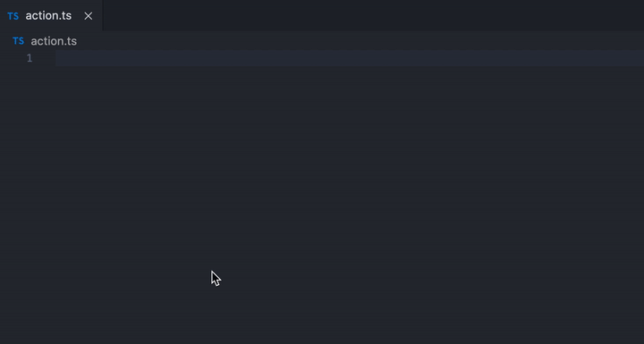
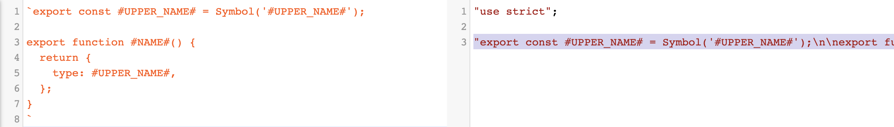
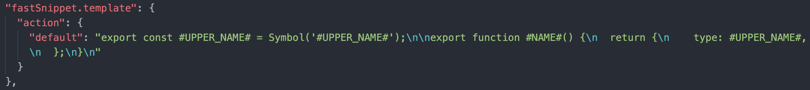

## Fast Snippet

a vscode extensions for fast write snippet to clipboard and rename

### 1. What it do

E.g:



### 2. Before use

step 1: write a template(suggest use template string by es6)

E.g:

```javascript
`export const #UPPER_NAME# = Symbol('#UPPER_NAME#');

export function #NAME#() {
  return {
    type: #UPPER_NAME#,
  };
}`;
```

step 2: translate to common string(if template is es6)

[babel online translator](https://babeljs.io/repl/#?browsers=&build=&builtIns=false&spec=false&loose=false&code_lz=FBA&debug=false&forceAllTransforms=false&shippedProposals=false&circleciRepo=&evaluate=true&fileSize=false&timeTravel=false&sourceType=module&lineWrap=false&presets=es2015%2Creact%2Cstage-2&prettier=false&targets=&version=7.12.9&externalPlugins=) can do it easy!



step 3: copy template and put in `settings.json`

setting name is call `fastSnippet.template`



step 4: enjoy it!
