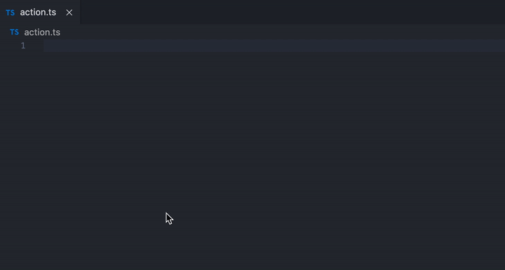
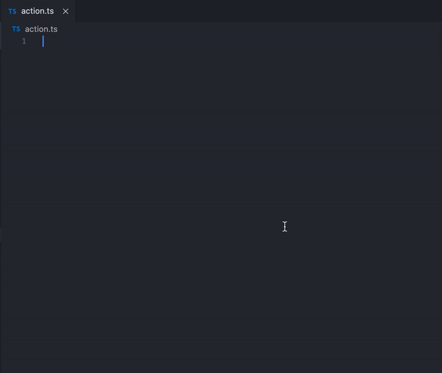
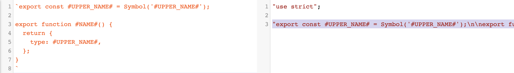
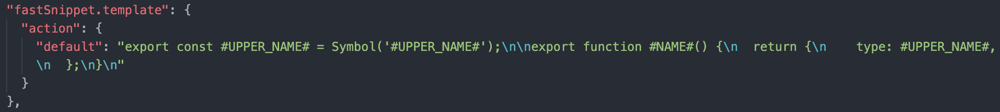

## Fast Snippet

a vscode extensions for fast write snippet to clipboard

### 1. What it do

replace snippet keyword by rule and copy to clipboard

#### 1.1 rule table

e.g name: loadUserInfo

| keyword                  | result           |
| ------------------------ | ---------------- |
| `#NAME#`                 | `loadUserInfo`   |
| `#UPPER_NAME#`           | `LOADUSERINFO`   |
| `#FIRSET_UPPER_NAME#`    | `LoadUserInfo`   |
| `#UPPER_UNDERLINE_NAME#` | `LOAD_USER_INFO` |
| `#LOWER_NAME#`           | `loaduserinfo`   |
| `#LOWER_UNDERLINE_NAME#` | `load_user_info` |

E.g:



#### 1.2 snippet:

```javascript
const template = `export const #UPPER_NAME# = Symbol('#UPPER_NAME#');

export function #NAME#() {
  return {
    type: #UPPER_NAME#,
  };
}`;
```

#### 1.3 name: loadUserInfo

#### 1.4 output:

```javascript
export const LOAD_USER_INFO = Symbol('LOAD_USER_INFO');

export function loadUserInfo() {
  return {
    type: LOAD_USER_INFO,
  };
}
```

#### 1.5 create multiple snippet:

split name by spaces



#### 1.6 right click menu


### 2. Before use

#### 2.1 step 1: write a template(suggest use template string by es6)

E.g:

```javascript
`export const #UPPER_NAME# = Symbol('#UPPER_NAME#');

export function #NAME#() {
  return {
    type: #UPPER_NAME#,
  };
}`;
```

#### 2.2 step 2: translate to common string(if es6)

[Babel online translator](https://babeljs.io/repl/#?browsers=&build=&builtIns=false&spec=false&loose=false&code_lz=FBA&debug=false&forceAllTransforms=false&shippedProposals=false&circleciRepo=&evaluate=true&fileSize=false&timeTravel=false&sourceType=module&lineWrap=false&presets=es2015%2Creact%2Cstage-2&prettier=false&targets=&version=7.12.9&externalPlugins=) can do it easy!



#### 2.3 step 3: copy and put in `settings.json`

setting name is `fastSnippet.template`



#### 2.4 step 4: enjoy it!
